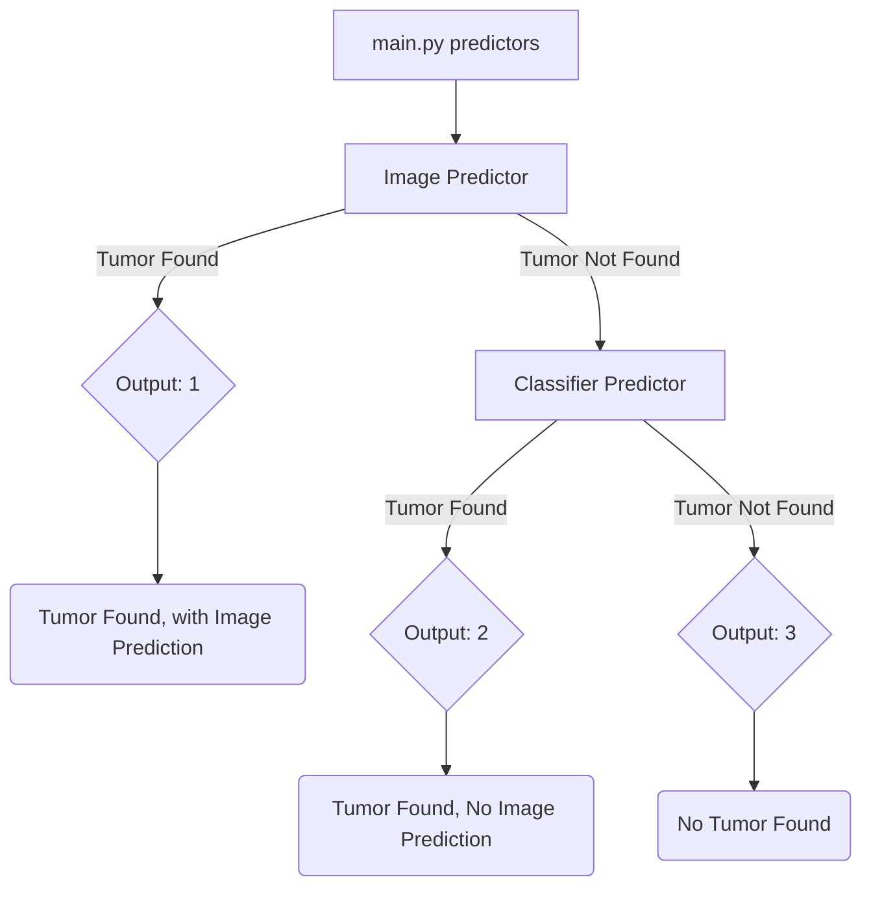

# ieee-project-mri
Detecting Tumors with ML and MRI Image scans

The one important file is [main.py](main.py), which runs both of the predictors. The Classifier Predictor checks if a tumor exists or not, the Image Predictor tries to predict where the tumor is.

By running the predictors function with a path to an image as input, it has three outputs,

Whenever [main.py](main.py) is run, new **Image Predictions** are saved here for now: 
[PredictionComparison.png](PredictionComparison.png)
[Prediction.png](Prediction.png)

**Classifier Model** was made using [this colab](https://colab.research.google.com/drive/1cSoonqLZVCLv5-yPecUluVZ00JYyFa5v#scrollTo=YTPZw3Y84AHk) and is saved in these files: [model.h5](model.h5) [model.json](model.json) 

**Image Model** was made using [mainNotebook.ipynb](mainNotebook.ipynb) and is saved in [unet_brain_mri_seg_official.hdf5](unet_brain_mri_seg_official.hdf5)

Some of the data used:
https://www.kaggle.com/sartajbhuvaji/brain-tumor-classification-mri
https://www.kaggle.com/navoneel/brain-mri-images-for-brain-tumor-detection
https://www.kaggle.com/datasets/mateuszbuda/lgg-mri-segmentation
